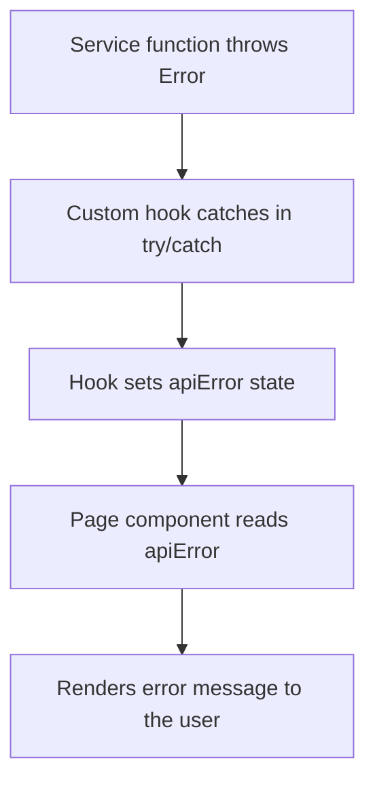

All network requests to TheMealDB are centralized in a single file: `src/services/api.js`. No component or hook fetches data directly — they all call one of the exported functions from this module.

This keeps network logic out of the UI layer and makes it straightforward to test, mock, or swap the data source later.

## Full source

```javascript src/services/api.js
const URL_BASE = "https://themealdb.com/api/json/v1/1/";

const apiOk = (res) => {
  if (!res.ok) {
    throw new Error(`The Meal Error: ${res.status}`);
  }
};

const apiMealOk = (data) => {
  if (!data.meals?.length) {
    throw new Error(
      "No se ha localizado ninguna receta con los datos introducidos",
    );
  }
};

// Consulta API para Busqueda por Nombre
export const getRecipeByName = async (search) => {
  const res = await fetch(`${URL_BASE}search.php?s=${search}`);
  apiOk(res);
  const data = await res.json();
  apiMealOk(data);
  return data.meals.map((e) => {
    return {
      id: e.idMeal,
      name: e.strMeal,
      picture: e.strMealThumb,
      category: e.strCategory,
    };
  });
};

// Consulta API para Busqueda por ID
export const getRecipeById = async (id) => {
  const res = await fetch(`${URL_BASE}lookup.php?i=${id}`);
  apiOk(res);
  const data = await res.json();
  apiMealOk(data);

  const meal = data.meals[0];
  const ingredients = [];

  for (let i = 1; i <= 20; i++) {
    const ingredient = meal[`strIngredient${i}`];
    const measure = meal[`strMeasure${i}`];
    if (ingredient && ingredient.trim() !== "") {
      ingredients.push({
        name: ingredient,
        measure: measure,
      });
    }
  }

  return {
    id: meal.idMeal,
    name: meal.strMeal,
    picture: meal.strMealThumb,
    category: meal.strCategory,
    instructions: meal.strInstructions,
    video: meal.strYoutube,
    ingredients,
  };
};

export const getRandomRecipes = async () => {
  const requests = Array.from({ length: 9 }, () =>
    fetch(`${URL_BASE}random.php`),
  );
  const responses = await Promise.all(requests);
  responses.forEach(apiOk);
  const data = await Promise.all(responses.map((res) => res.json()));
  data.forEach(apiMealOk);
  const meals = data.map((d) => d.meals[0]);
  return meals.map((e) => ({
    id: e.idMeal,
    name: e.strMeal,
    picture: e.strMealThumb,
    category: e.strCategory,
  }));
};
```

---

## Private helpers

Two private functions validate every response before any data is processed. They are not exported and cannot be called outside this module.

<AccordionGroup>
  <Accordion title="apiOk(res)" icon="circle-check">
    Checks the HTTP response status. Called immediately after every `fetch` call.

    ```javascript
    const apiOk = (res) => {
      if (!res.ok) {
        throw new Error(`The Meal Error: ${res.status}`);
      }
    };
    ```

    **Throws:** `Error` with message `"The Meal Error: {status}"` when `res.ok` is `false` (i.e., any non-2xx HTTP status code).
  </Accordion>
  <Accordion title="apiMealOk(data)" icon="utensils">
    Checks the parsed JSON payload. Called after `res.json()` to confirm that the API returned at least one meal.

    ```javascript
    const apiMealOk = (data) => {
      if (!data.meals?.length) {
        throw new Error(
          "No se ha localizado ninguna receta con los datos introducidos",
        );
      }
    };
    ```

    **Throws:** `Error` with message `"No se ha localizado ninguna receta con los datos introducidos"` when `data.meals` is `null`, `undefined`, or an empty array. TheMealDB returns `{ "meals": null }` for queries that match nothing.
  </Accordion>
</AccordionGroup>

---

## Exported functions

### `getRecipeByName(search)`

Searches TheMealDB by meal name and returns a list of matching meals.

**Parameters**

<ParamField path="search" type="string" required>
  The meal name to search for. Passed directly to the `s` query parameter of the TheMealDB search endpoint.
</ParamField>

**Returns**

`Promise<Array<{id: string, name: string, picture: string, category: string}>>`

<ResponseField name="id" type="string" required>
  TheMealDB meal ID (`idMeal`).
</ResponseField>
<ResponseField name="name" type="string" required>
  Meal name (`strMeal`).
</ResponseField>
<ResponseField name="picture" type="string" required>
  URL to the meal thumbnail (`strMealThumb`).
</ResponseField>
<ResponseField name="category" type="string" required>
  Meal category (`strCategory`).
</ResponseField>

**Throws**

- `apiOk` throws if the HTTP request fails (non-2xx status).
- `apiMealOk` throws if no meals match the search query.

---

### `getRecipeById(id)`

Fetches the full detail record for a single meal by its TheMealDB ID.

**Parameters**

<ParamField path="id" type="string" required>
  The TheMealDB meal ID. Typically obtained from a `getRecipeByName` or `getRandomRecipes` result.
</ParamField>

**Returns**

`Promise<{id, name, picture, category, instructions, video, ingredients}>`

<ResponseField name="id" type="string" required>
  TheMealDB meal ID.
</ResponseField>
<ResponseField name="name" type="string" required>
  Meal name.
</ResponseField>
<ResponseField name="picture" type="string" required>
  Thumbnail URL.
</ResponseField>
<ResponseField name="category" type="string" required>
  Meal category.
</ResponseField>
<ResponseField name="instructions" type="string" required>
  Full cooking instructions (`strInstructions`).
</ResponseField>
<ResponseField name="video" type="string">
  YouTube URL for the recipe (`strYoutube`). May be an empty string.
</ResponseField>
<ResponseField name="ingredients" type="object[]" required>
  Parsed list of ingredients. See below for the item shape.
  <Expandable title="ingredient properties">
    <ResponseField name="name" type="string" required>
      Ingredient name.
    </ResponseField>
    <ResponseField name="measure" type="string" required>
      Quantity and unit (e.g., `"3/4 cup"`).
    </ResponseField>
  </Expandable>
</ResponseField>

**Ingredient parsing**

TheMealDB encodes ingredients as 20 flat fields (`strIngredient1`–`strIngredient20`) rather than an array. `getRecipeById` normalizes this into a clean array:

<Steps>
  <Step title="Iterate over all 20 slots">
    A `for` loop runs from `i = 1` to `i = 20`, reading `meal[\`strIngredient${i}\`]` and `meal[\`strMeasure${i}\`]`.
  </Step>
  <Step title="Filter empty slots">
    If the ingredient string is falsy or whitespace-only (`ingredient.trim() === ""`), the slot is skipped. TheMealDB fills unused slots with `""` or `null`.
  </Step>
  <Step title="Push to the array">
    Valid `{ name, measure }` pairs are pushed to the `ingredients` array, which is returned as part of the meal object.
  </Step>
</Steps>

**Throws**

- `apiOk` throws if the HTTP request fails.
- `apiMealOk` throws if the ID does not exist in TheMealDB.

---

### `getRandomRecipes()`

Fetches 9 random meals in parallel and returns them as an array.

This function takes no parameters.

**Returns**

`Promise<Array<{id: string, name: string, picture: string, category: string}>>` — always resolves to exactly 9 items when successful.

**Parallel fetch strategy**

The function uses `Array.from` with a mapping function to create 9 fetch `Promise` objects simultaneously, then settles them all with `Promise.all`:

```javascript parallel fetch
// Create 9 in-flight fetch promises at once
const requests = Array.from({ length: 9 }, () =>
  fetch(`${URL_BASE}random.php`),
);

// Wait for all responses, then parse all JSON bodies
const responses = await Promise.all(requests);
responses.forEach(apiOk);
const data = await Promise.all(responses.map((res) => res.json()));
```

This is significantly faster than awaiting each request sequentially, since all 9 network round-trips happen concurrently.

**Throws**

- `apiOk` throws if **any** of the 9 HTTP responses is not OK. Because `forEach(apiOk)` runs synchronously after `Promise.all`, the first failing response causes an immediate throw.
- `apiMealOk` throws if any response body contains no meals.

---

## Error handling

Errors propagate through a consistent chain from the service layer to the UI:



<Tabs>
  <Tab title="Service throws">
    ```javascript src/services/api.js
    // apiOk throws on non-2xx HTTP status
    if (!res.ok) {
      throw new Error(`The Meal Error: ${res.status}`);
    }

    // apiMealOk throws when the API returns no results
    if (!data.meals?.length) {
      throw new Error("No se ha localizado ninguna receta con los datos introducidos");
    }
    ```
  </Tab>
  <Tab title="Hook catches">
    ```javascript src/hooks/useRecipes.js (excerpt)
    const fetchRecipes = async (search) => {
      setLoading(true)
      setRecipes([])
      setApiError("")
      try {
        const data = await getRecipeByName(search)
        setRecipes(data)
      } catch (error) {
        return setApiError(error.message)
      } finally {
        setLoading(false)
      }
    }
    ```
  </Tab>
  <Tab title="Page renders">
    ```jsx example page
    {apiError && (
      <p className="error-message">{apiError}</p>
    )}
    ```
  </Tab>
</Tabs>

Because all three service functions throw `Error` objects with descriptive messages, the hook does not need to distinguish between error types — it always sets `apiError` to `error.message` and the page renders it directly.

---

## Extending the service layer

<Tip>
  To add a new endpoint — for example, filtering meals by category (`filter.php?c=Seafood`) — follow the same three-step pattern used by every existing function: fetch the URL, validate the HTTP response with `apiOk`, validate the data with `apiMealOk`, then map the raw meal objects to a clean shape before returning them.
</Tip>

```javascript adding a new endpoint
export const getRecipesByCategory = async (category) => {
  const res = await fetch(`${URL_BASE}filter.php?c=${category}`);
  apiOk(res);
  const data = await res.json();
  apiMealOk(data);
  return data.meals.map((e) => ({
    id: e.idMeal,
    name: e.strMeal,
    picture: e.strMealThumb,
  }));
};
```
